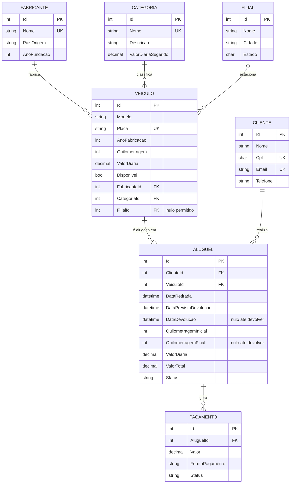

# Locadora de Veículos — API REST

Trabalho Prático (TP1) — sistema de aluguel de veículos desenvolvido em **C# / .NET 8**,
com **Entity Framework Core**, **SQL Server Express** e **Swagger**.

---

## 1. O que já está pronto

| Etapa | Descrição | Situação |
|-------|-----------|----------|
| 1 | Modelagem do banco (7 entidades, PKs, FKs, restrições, `ApplicationContext`) | ✅ Concluída |
| 2 | Backend ASP.NET Core com CRUD completo + 6 filtros com JOIN | ✅ Concluída |
| 3 | Swagger integrado + documentação dos endpoints | ✅ Concluída (relatório de testes precisa dos seus prints) |
| 4 | Vídeo em formato pitch (6 a 12 min) | ⬜ A gravar — roteiro em [`docs/04-roteiro-video.md`](docs/04-roteiro-video.md) |

---

## 2. Estrutura do projeto

```
LocadoraVeiculos.sln
└── src/LocadoraVeiculos.API/
    ├── Models/              → camada Model: as 7 entidades e os enums
    ├── Data/
    │   ├── ApplicationContext.cs    → mapeamento EF Core (PKs, FKs, restrições)
    │   └── DatabaseInitializer.cs   → cria o banco e insere a carga inicial
    ├── DTOs/                → objetos de entrada/saída da API, com validações
    ├── Controllers/         → 8 controllers (7 de CRUD + 1 de consultas)
    ├── Validacoes/          → validador de CPF (dígitos verificadores)
    ├── Middlewares/         → tratamento global de erros
    └── Program.cs           → configuração da aplicação (EF, Swagger, JSON)
```

---

## 3. Como rodar

### Pré-requisitos
- [.NET SDK 8.0](https://dotnet.microsoft.com/download/dotnet/8.0)
- SQL Server Express instalado e rodando (instância padrão `localhost\SQLEXPRESS`)

### Passo a passo

```bash
# 1. Restaurar os pacotes NuGet
dotnet restore

# 2. (Opcional, porém recomendado) gerar a migration inicial
dotnet tool install --global dotnet-ef          # só na primeira vez
dotnet ef migrations add CriacaoInicial --project src/LocadoraVeiculos.API
dotnet ef database update --project src/LocadoraVeiculos.API

# 3. Executar a API
dotnet run --project src/LocadoraVeiculos.API
```

Abra o navegador em **https://localhost:7100** — o Swagger abre direto na raiz.

> **Se você pular o passo 2**, tudo continua funcionando: na primeira execução a aplicação
> cria o banco automaticamente a partir do modelo (`EnsureCreated`) e insere a carga inicial
> de dados. A migration é recomendada porque é o artefato que comprova a tradução
> "modelo conceitual → esquema relacional" pedida no item 1.2 do enunciado.

### Se a conexão falhar

Ajuste a connection string em `src/LocadoraVeiculos.API/appsettings.json`:

```json
"SqlServer": "Server=localhost\\SQLEXPRESS;Database=LocadoraVeiculos;Trusted_Connection=True;TrustServerCertificate=True;MultipleActiveResultSets=True"
```

- Instância nomeada diferente? Troque `localhost\SQLEXPRESS` pelo nome correto.
- Usando usuário e senha em vez de autenticação do Windows? Troque
  `Trusted_Connection=True` por `User Id=sa;Password=SuaSenha;`.

---

## 4. Modelo de dados

7 entidades (o enunciado pedia no mínimo 5):



Detalhes da modelagem (regras do enunciado, restrições e decisões de projeto)
em [`docs/01-modelagem.md`](docs/01-modelagem.md).

---

## 5. Endpoints

| Recurso | Rota base | Operações |
|---------|-----------|-----------|
| Fabricantes | `/api/fabricantes` | GET, GET/{id}, POST, PUT, DELETE |
| Categorias | `/api/categorias` | GET, GET/{id}, POST, PUT, DELETE |
| Filiais | `/api/filiais` | GET, GET/{id}, POST, PUT, DELETE |
| Veículos | `/api/veiculos` | GET, GET/{id}, POST, PUT, DELETE |
| Clientes | `/api/clientes` | GET, GET/{id}, POST, PUT, DELETE |
| Aluguéis | `/api/alugueis` | GET, GET/{id}, POST, PUT, DELETE, PUT/{id}/retirada, PUT/{id}/devolucao, PUT/{id}/cancelamento |
| Pagamentos | `/api/pagamentos` | GET, GET/{id}, POST, PUT, DELETE |
| **Consultas com JOIN** | `/api/consultas` | 6 filtros (veja abaixo) |

### Os 6 filtros com JOIN (requisito 2.5)

| # | Rota | Tipos de JOIN |
|---|------|---------------|
| 1 | `GET /api/consultas/veiculos-disponiveis` | INNER JOIN + LEFT JOIN |
| 2 | `GET /api/consultas/historico-cliente` | INNER JOIN encadeado (4 tabelas) |
| 3 | `GET /api/consultas/veiculos-nunca-alugados` | LEFT JOIN com filtro `IS NULL` |
| 4 | `GET /api/consultas/faturamento-por-cliente` | LEFT JOIN + GROUP BY |
| 5 | `GET /api/consultas/alugueis-atrasados` | INNER JOIN + LEFT JOIN + DATEDIFF |
| 6 | `GET /api/consultas/faturamento-por-categoria` | INNER JOIN + GROUP BY |

Documentação completa de parâmetros e códigos de resposta em
[`docs/02-documentacao-api.md`](docs/02-documentacao-api.md).

---

## 6. Dados de exemplo

Na primeira execução são inseridos automaticamente: 5 fabricantes, 5 categorias,
3 filiais, 10 veículos, 5 clientes, 7 aluguéis (finalizados, em andamento, atrasado
e reservado) e 6 pagamentos — o suficiente para que todas as consultas retornem
resultados interessantes já no primeiro teste.

---

## 7. Documentação

- [`docs/01-modelagem.md`](docs/01-modelagem.md) — modelo conceitual, PKs, FKs e restrições
- [`docs/02-documentacao-api.md`](docs/02-documentacao-api.md) — todos os endpoints
- [`docs/03-relatorio-de-testes.md`](docs/03-relatorio-de-testes.md) — roteiro de testes para os prints
- [`docs/04-roteiro-video.md`](docs/04-roteiro-video.md) — roteiro do vídeo pitch
